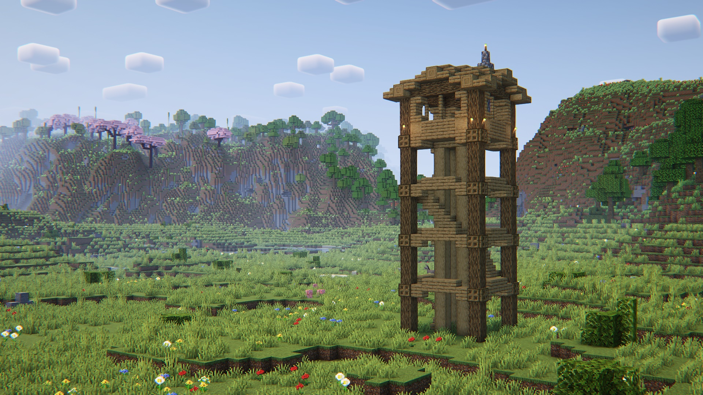

**Сторона:** Лише сервер  
**Modrinth:** [explorify](https://modrinth.com/datapack/explorify)  

---

## Що це таке

Explorify додає колекцію нових, ретельно створених структур до твого Minecraft-світу, що виглядають так, ніби вони завжди там були. Філософія дизайну сувора: кожна структура має виглядати та відчуватися як частина ванільного Minecraft — жодних різких тем, жодного надмірного луту, жодних мегаструктур розміром з вежу.

Це структури, повз які ти можеш пройти і подумати «о, цікаво» — покинутий табір мандрівника, що давно зник, кам'яний міст, що обвалюється над яром, невелика порослa руїна посеред лісу. Делікатні, атмосферні й захопливі.

---

---

## Філософія дизайну

Explorify свідомо уникає пастки «чим більше, тим краще». Замість величезних підземель або складних арен з босами, акцент зроблено на:

- **Тематичній відповідності** — структури використовують ванільні блоки і виглядають органічно
- **Прив'язці до біомів** — більшість структур з'являються лише у відповідних біомах
- **Розповіді через оточення** — жодних письмових пояснень передісторії; сама структура розповідає свою історію
- **Ванільному луті** — скрині (де є) використовують існуючі ванільні таблиці луту

---

## Типи структур

Explorify включає різноманітні структури, що з'являються в різних біомах і типах місцевості:

**Звичайний світ — Загальні**
- Занедбані табори з вогнищами та розкиданим спорядженням
- Порослі мохом кам'яні руїни забутих споруд
- Невеликі мости та переправи через річки та яри
- Давні колодязі на рівнинах і луках
- Пустельні святилища з пісковими колонами
- Джунглеві вівтарі та порослa мохом кам'яна кладка

**Звичайний світ — Специфічні для біому**
- Замерзлі вогнища та заметені сніговища в тундрі
- Мангрові платформи у болотах
- Кільця грибних суперечок у темних лісах
- Павільйони серед сакури в біомах вишневого гаю
- Скульптурні кам'яні утворення в бедленді

**Підземні та печерні**
- Табори спелеологів у великих печерах
- Невеликі підземні святилища зі свічками
- Обвалені шахтні конструкції

---

## Пошук структур

Структури Explorify **рідкісні за задумом**. Кожні 100 блоків їх не зустрінеш — вони призначені для органічного відкриття під час дослідження.

---

## Лут

Більшість структур Explorify, що містять лут, використовують **ванільні таблиці луту** — такі ж, як у звичайних структурах Minecraft. Це означає:

- Жодних кастомних предметів, що виглядають чужорідно
- Повна сумісність з датапаками таблиць луту
- Лут відповідає масштабу знайденої структури

Деякі структури взагалі не мають луту і є суто декоративними — кам'яний міст не потребує скрині, щоб бути цікавим.
