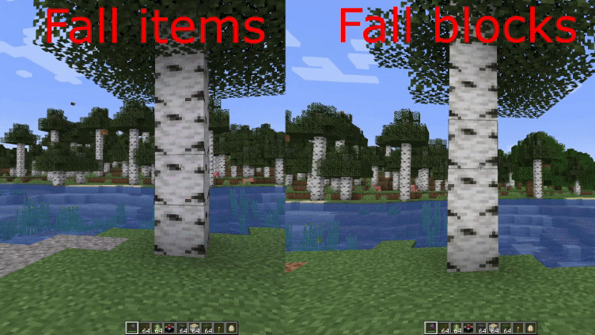

**Сторона:** Лише сервер  
**Modrinth:** [fallingtree](https://modrinth.com/mod/fallingtree)

---

## Що це таке

FallingTree змінює спосіб рубки дерев: замість того щоб ламати кожен блок колоди знизу вгору, **злам будь-якої однієї колоди в дереві призводить до падіння всього дерева одразу**. Весь стовбур і всі прикріплені колоди ламаються одночасно, а всі дропи з'являються на позиції зламаного блоку.

Це не читерство — міцність інструмента витрачається так, ніби ти зламав кожен блок окремо. Змінюється лише час, витрачений на це.

---

---

## Вимога до інструменту

За замовчуванням FallingTree активується лише при **утриманні сокири**. Без сокири в руці дерева ламаються звично блок за блоком.

---

## Перемикач присіданням

За замовчуванням **присідання (Shift) під час зламу колоди вимикає FallingTree** для цього удару — блок ламається звично. Це дозволяє акуратно прибирати окремі колоди без падіння всього дерева.

Поведінку можна інвертувати: присідання **вмикає** FallingTree, а звичайний злам залишає дерева цілими.

---

## Міцність та чари

Міцність інструменту витрачається за кожну колоду в дереві, а не лише за зламану. Дерево з 60 колод коштує 60 міцності. Це зберігає баланс.

---

## Гниття листя

Коли дерево падає, листя, прикріплене до нього, починає природно гнити. FallingTree опціонально включає **прискорене гниття листя** — листя зникає набагато швидше, ніж при стандартному ванільному гнитті.
