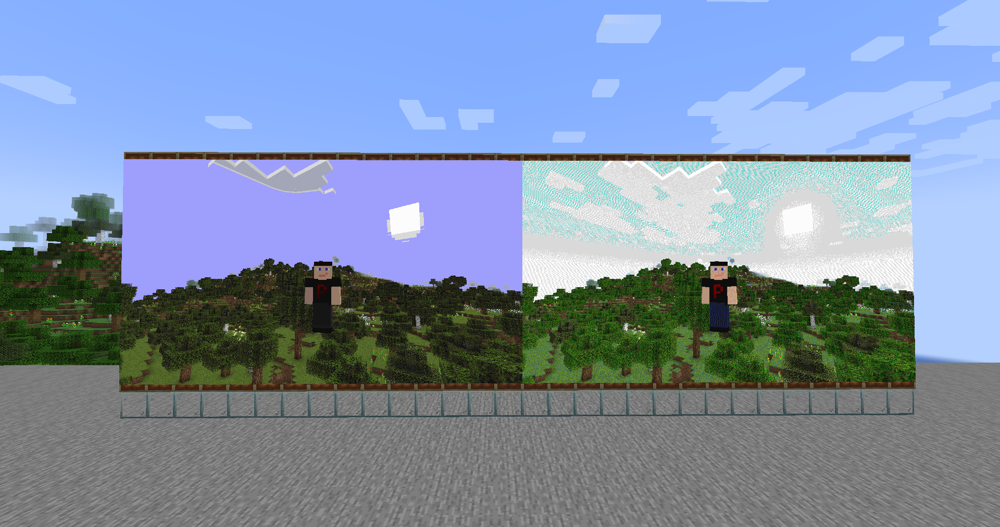

**Modrinth:** [image2map](https://modrinth.com/mod/image2map)

---

## Що це таке

Image2Map дозволяє конвертувати будь-який файл зображення (PNG, JPG тощо) у предмети-карти Minecraft, що відображають це зображення у грі. Потім ці карти можна розмістити в рамках для предметів на стінах, щоб створювати піксельні художні роботи, кастомні вивіски, логотипи, банери або будь-який інший візуальний контент — без ручного розміщення жодного пікселя.


---


---

## Як це працює

1. Завантаж зображення на сервер або зроби його доступним за URL
2. Використай команду `/image2map create` для конвертації зображення у предмети-карти (або `/image2map preview` для динамічного перегляду перед збереженням)
3. Розміщи отримані карти в рамках для предметів у правильному порядку
4. Зображення з'являється як суцільний дисплей на твоїй стіні

Карти, створені Image2Map — це звичайні предмети-карти Minecraft, які повністю сумісні з ванільними механіками.


---

## Одна карта проти сітки

**Одна карта (128×128 пікселів):**
Одна карта Minecraft представляє один відрізок 128×128 пікселів зображення. Розміщується в одній рамці.

**Сітки з декількох карт:**
Для більших дисплеїв зображення ділиться на сітку плиток 128×128. Зображення 256×256 стає сіткою 2×2 з чотирьох карт. Кожна карта позначена, щоб ти знав, куди її поставити.

---

## Команди

| Команда | Опис |
|---|---|
| `/image2map create <ширина> <висота> <dither/none> <url>` | Створює карту вказаного розміру (у пікселях; одна карта — 128×128), з дитеруванням або без, за наданим зображенням |
| `/image2map create <dither/none> <url>` | Створює карту з дитеруванням або без, за наданим зображенням |
| `/image2map preview <url>` | Створює динамічний попередній перегляд перед збереженням карти як предмета |

**Аргументи:**
- `<ширина>` і `<висота>` — розмір карти **у пікселях** (одна карта = 128×128, тож 256 — це дві плитки)
- `<dither/none>` — `dither` для дитерування або `none`, щоб вимкнути його
- `<url>` — пряме посилання на файл зображення (сервер завантажить його)

**Команди в режимі попереднього перегляду:**

| Команда | Опис |
|---|---|
| `/dither <dither/none>` | Змінює режим дитерування |
| `/size` | Показує поточний розмір |
| `/size <ширина> <висота>` | Змінює розмір карти на вказаний (у пікселях; одна карта — 128×128) |
| `/grid` | Перемикає видимість сітки карт |
| `/save` | Виходить з перегляду та зберігає карту як предмети |
| `/exit` | Виходить з перегляду без збереження |

**Приклад — одна карта з дитеруванням:**
```
/image2map create dither https://example.com/logo.png
```

**Приклад — дисплей 384×256 пікселів (сітка 3×2) без дитерування:**
```
/image2map create 384 256 none https://example.com/banner.png
```

Це створить 6 предметів-карт (3 стовпці × 2 рядки) для розміщення в сітці 3×2 з рамок.

---

## Розміщення дисплею

Після отримання предметів-карт:

1. Розмісти **рамки для предметів** на стіні в правильному порядку сітки
2. Помісти кожну карту у відповідну рамку — карти пронумеровані для вказівки позиції в сітці
3. Зображення з'являється суцільним по всіх рамках

