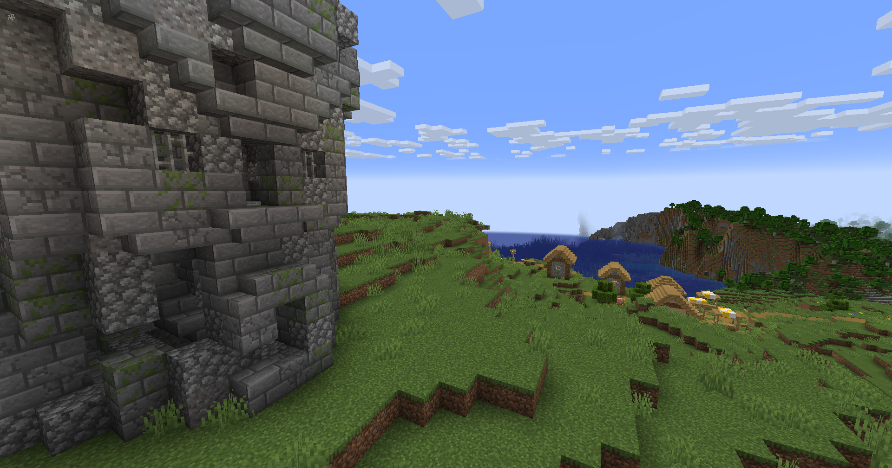
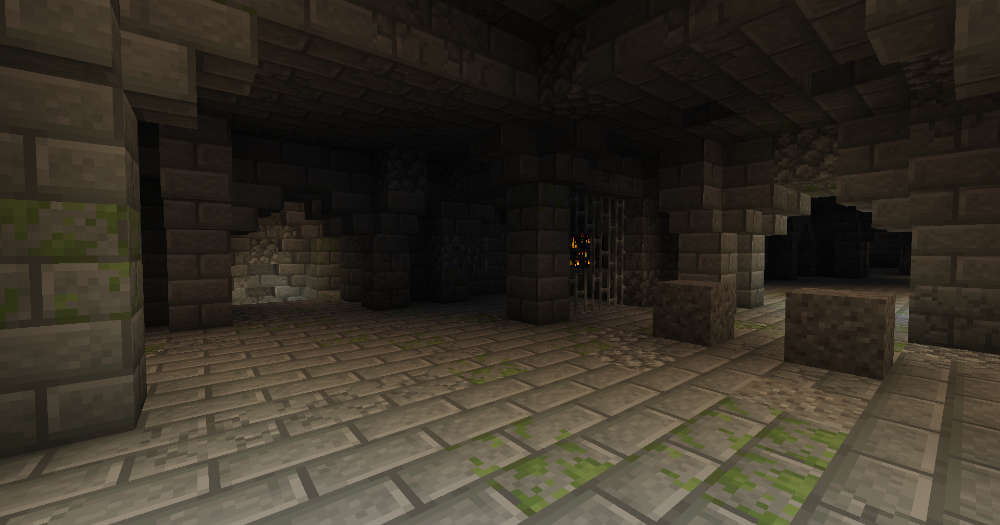
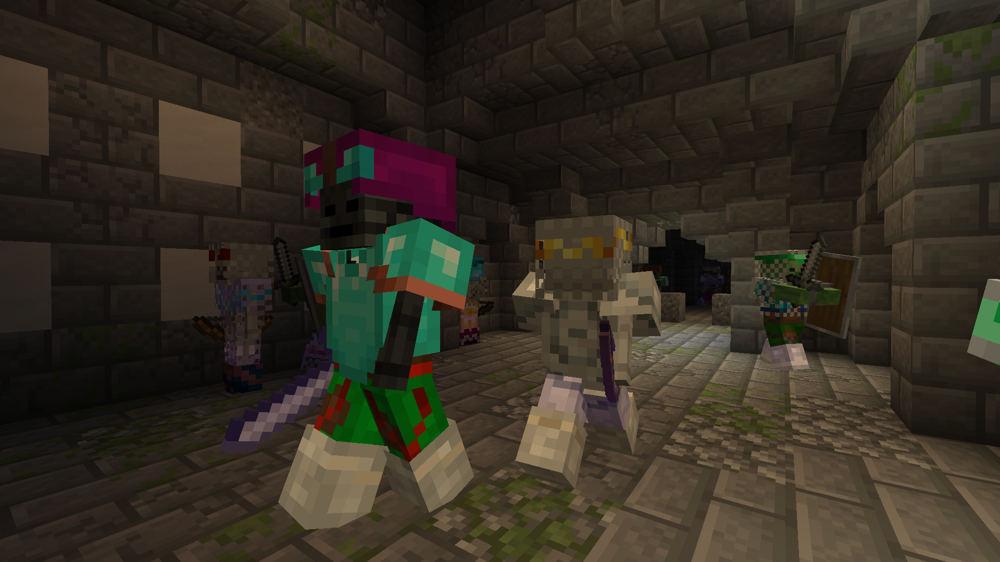

**Сторона:** Лише сервер (також працює в одиночній грі)  
**Modrinth:** [roguelikedungeons](https://modrinth.com/mod/roguelikedungeons)

---

## Що це таке

Roguelike Dungeons генерує масивні, багатоповерхові підземелля-вежі, що з'являються по всьому твоєму Minecraft-світу. З поверхні ти бачиш високу темну кам'яну вежу — але справжнє підземелля знаходиться під нею, глибоко в землі, на декількох окремих поверхах, кожен з яких заповнений кімнатами, коридорами, пастками, спавнерами мобів та скринями з лутом.

Це не маленькі ванільні підземелля. Одне Roguelike Dungeon — це повноцінне пригодницьке підземелля, на повне зачищення якого група гравців може витратити кілька годин.

---

## Огляд структури

Кожне підземелля генерується процедурно за допомогою системи компонування, яка випадково збирає кімнати з великого пулу шаблонів. Жодні два підземелля не ідентичні, але всі мають однаковий загальний вигляд:

**Вежа (поверхня)**
Висока вежа з кам'яної цегли, що позначає вхід у підземелля. Містить сходи вниз і іноді контент верхніх поверхів.

**Підземні поверхи**
Декілька поверхів, що простягаються вниз. Кожен поверх — мережа з'єднаних кімнат, розділених коридорами та сходами. Поверхи стають все складнішими при спуску.

**Типи кімнат**

- **Бібліотека** — книжкові полиці, кафедри, можливо чарівний стіл
- **Кімната ковалів** — столи для ковальства, ковадла
- **Кухня** — верстати, барелі з їжею
- **Варильна кімната** — стійки для варіння, інгредієнти для зілля
- **Паноптикум** — кругова оглядова кімната з мобами на верхніх ярусах
- **Кімната-головоломка** — натискні плити, розтяжки, редстоун-механізми
- **Кімната боса** — більша зала з щільнішими спавнерами
- **Скарбниця** — декілька скринь, зазвичай з більшою кількістю пасток
- **Порожні/відпочинкові кімнати** — місця для перепочинку між боями
- **Декоративні кімнати** — атмосферне заповнення

Не всі кімнати з'являються в кожному підземеллі — система компонування випадково обирає та розташовує їх щоразу.

---

## Моби та складність

Спавнери розміщені по всьому підземеллю. Стандартні типи спавнерів включають скелетів, зомбі та павуків на верхніх поверхах, з більш небезпечними варіантами глибше.

Спавнери залишаються активними нескінченно — зачищення підземелля є безперервним процесом, якщо не знищувати або не освітлювати спавнери.

---

## Лут

Скрині використовують процедурну систему луту з декількома рівнями:

- **Стандартні скрині** — звичайні предмети, їжа, базове спорядження
- **Рідкісні скрині** — краще зачароване спорядження, рідкісніші ресурси
- **Предмети з незеріту** — надзвичайно рідкісні, зазвичай лише на найглибших поверхах

---

## Пастки

Roguelike Dungeons включає навколишні небезпеки:

- **Натискна плита + диспенсер** — стріляє стрілами або зіллями
- **Розтяжки** — спрацьовують при перетині
- **Вибухові пастки** — на основі ТНТ
- **Ямні пастки** — підлога з прихованими провалами

Пастки стають частішими та складнішими на нижніх поверхах.

---

## Поради для гравців

- **Бери багато смолоскипів** — темрява найнебезпечніша; освітлення кімнат прибирає умови для спавну мобів із спавнерів
- **Знищуй або освітлюй спавнери** — інакше моби будуть з'являтися нескінченно
- **Вежа — не все підземелля** — справжній контент під землею; не зупиняйся на рівні поверхні
- **Зачищай поверх за поверхом** — не поспішай вглиб до зачищення поверху вище; потрібен шлях відступу
- **Слідкуй за підлогою** — натискні плити та розтяжки всюди на нижніх поверхах
- **Бери щит** — спавнери скелетів у коридорах жорсткі
- **Бери відро з водою** — деякі кімнати використовують лаву або вогонь
- **Не відкривай кожну скриню одразу** — спочатку перевір оточення на пастки
