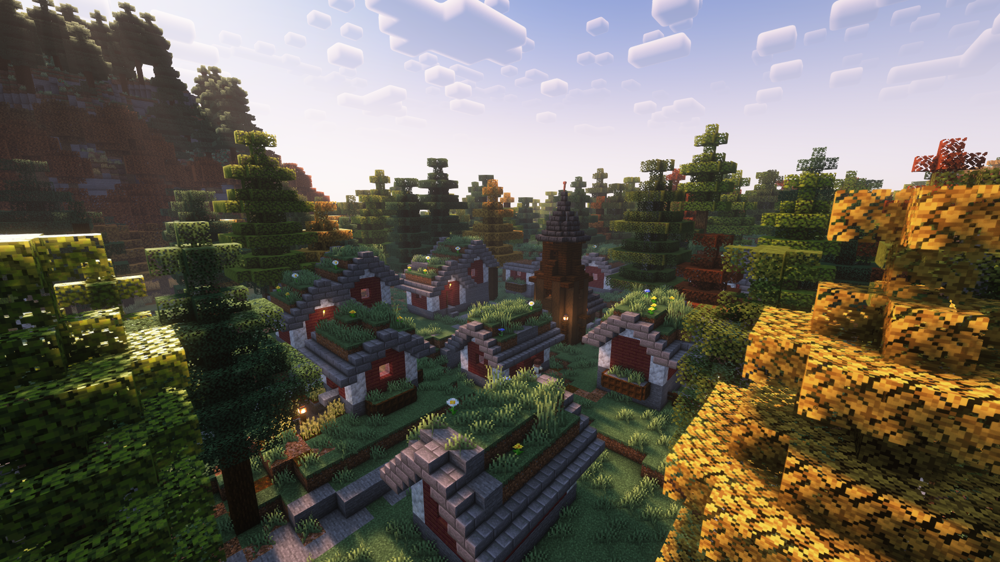
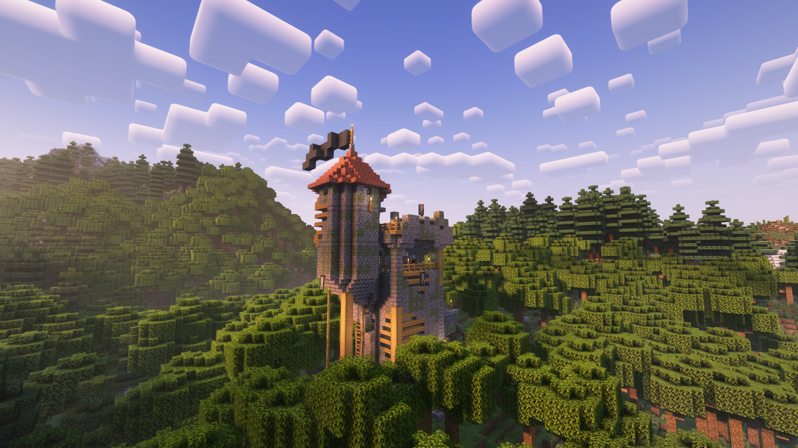

**Сторона:** Лише сервер   

**Modrinth:** [towns-and-towers](https://modrinth.com/mod/towns-and-towers)

---

## Що це таке

Towns and Towers розширює ванільну генерацію світу новими варіантами сіл та форпостів розбійників. Замість кількох повторюваних шаблонних будівель села стають більшими, різноманітнішими та унікальнішими для кожного біому, а форпости розбійників отримують нові форми — від невеликих веж до укріплених фортів.

Усі нові структури побудовані у ванільному стилі та використовують лише ванільні блоки, тому органічно вписуються у звичайний світ без потреби в текстур-паках чи клієнтських модах.

---

## Особливості

- Десятки нових будівель для сіл усіх типів (рівнина, пустеля, савана, тайга, засніжене)
- Нові варіанти форпостів розбійників: вежі, форти, табори
- Структури підлаштовуються під біом та рельєф
- Лише ванільні блоки — жодних кастомних текстур
- Сумісний з іншими модами генерації світу, що використовують теги структур

---

## Як це працює

Мод реєструє додаткові частини структур (jigsaw-фрагменти) у ванільні пули сіл та форпостів. Під час генерації нових чанків гра випадково обирає як ванільні, так і додані модом елементи, тож світ виглядає різноманітнішим без зміни самого алгоритму генерації.

> **Примітка:** Нові структури з'являються лише у **новозгенерованих** чанках. Вже досліджені ділянки світу залишаться без змін.

---

