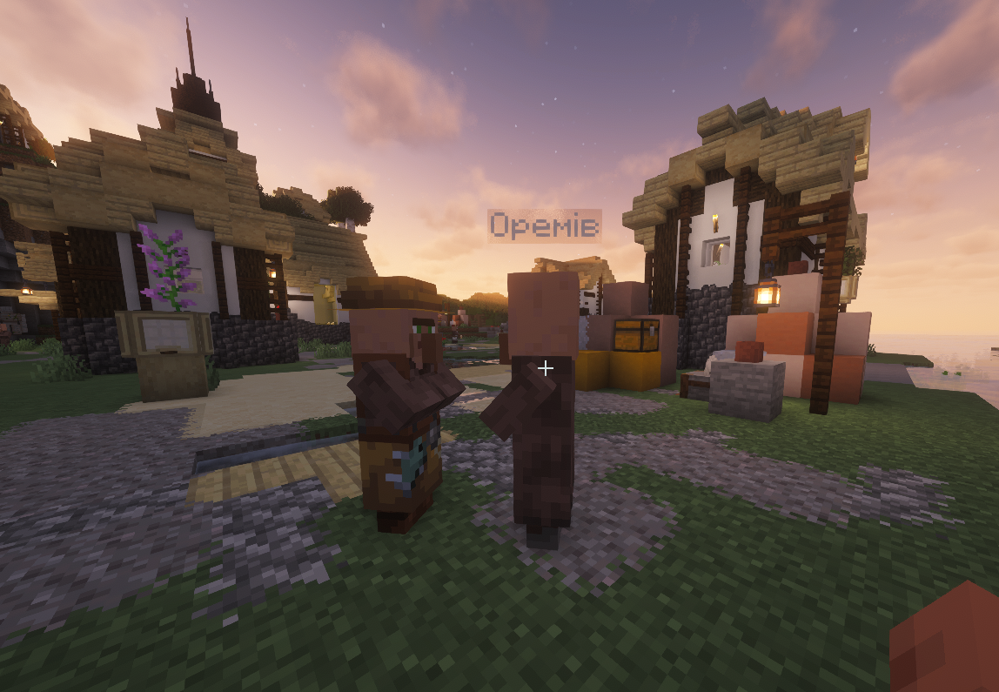

## Що це таке

VillagerNames дає кожному мешканцю у твоєму світі випадково згенероване ім'я, що плаває над головою. Замість того щоб кожен житель був безіменним «Фермером» або «Бібліотекарем», кожен має унікальне. Імена прив'язані до UUID жителя, тому вони залишаються після перезапуску.

Ця дрібна зміна робить села значно живішими. Ти починаєш впізнавати окремих торговців, пам'ятати, у кого хороші зачаровані книги, і відчувати щось, коли цей іменований житель потрапляє до зомбі.

## Особливості

- Імена вибираються випадково з великого вбудованого списку
- Імена прив'язані до кожного жителя (стабільні між перезавантаженнями)
- Сумісний з кастомними списками імен
- Не потрібен клієнтський мод

